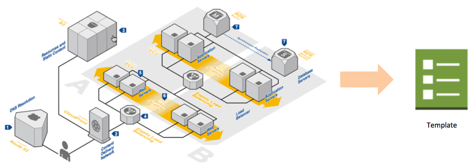
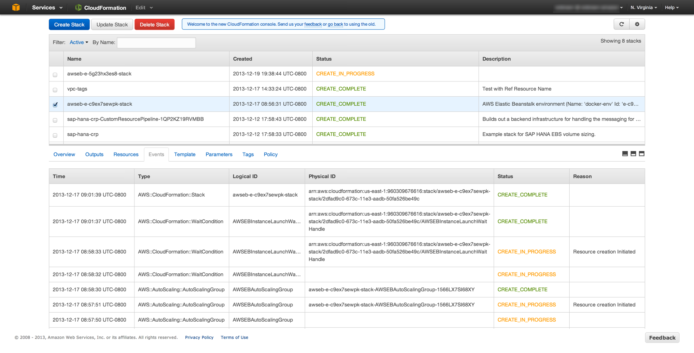
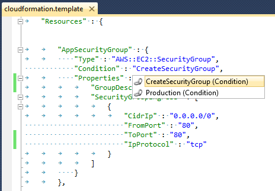
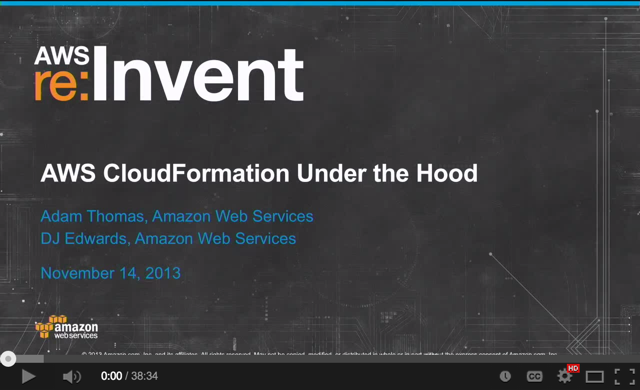
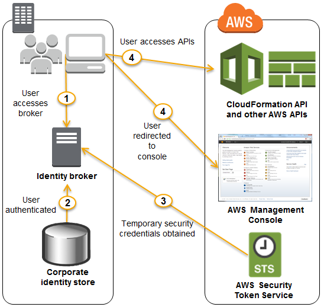

AWS CloudFormation: A Year in Review (Plus Q&A!) Hangout
========================================================
Thanks for joining our first CloudFormation hangout! Developer Community Manager Evan Brown (@evandbrown on [GitHub](http://github.com/evandbrown) and [Twitter](http://twitter.com/evandbrown)) will spend the first 15 minutes of the Hangout reviewing the major features that were introduced for CloudFormation in 2013, and the final 15 minutes answering your questions.

## About the Q&A
Q&A is enabled for this Hangout. To ask your question, click the Ask a new question button in the bottom-right corner of your screen, like so:

You can enter your questions at any point during the hangout. Keep in mind that it takes about 50 seconds before the audio and video to make it through all the tubes to your computer, so by the time you've typed your question we may be on another topic. But don't worry! We've got the final half of the Hangout reserved just for Q&A.

## What is CloudFormation 
AWS CloudFormation lets you create and manage a collection of related AWS resources, provisioning and updating them in an orderly and predictable fashion. Declare and manage your complete application environment, including VPCs, EC2 Instances in Auto Scaling Groups, RDS Databases, and more, all in a template file:

Store your template files in version control (e.g., git) and use them to launch identical stacks multiple times in multiple AWS Regions around the world.

## Last Night
### Updated CloudFormation Management Console
Adds features like auto-refreshing stack events and alphabetical ordering of stack parameters.

You can toggle back to the previous console if you like. Please click the _feedback_ link and give us your feedback.

### New Features for Existing Resources:
* **ELB Cross-Zone Load Balancing**
* **Elastic Beanstak Worker Tier**

## Expanded Service Coverage

### Available in GovCloud
Launched in GovCloud (US) in August. A variety of [complete sample templates are available](http://aws.amazon.com/cloudformation/aws-cloudformation-templates/aws-cloudformation-templates-govcloud-us).

### Support for New Resources
CloudFormation added support for a number of new AWS Resources and features in 2013, including:

#### ElastiCache Redis

        "RedisCluster" : {
          "Type": "AWS::ElastiCache::CacheCluster",
          "Properties": {
            "Engine"                  : "redis",
            "NumCacheNodes"           : "1"
            ...
          }
        }
    
* [Sample template](https://s3.amazonaws.com/cloudformation-templates-us-east-1/ElastiCache_Redis.template)

* Run from [CLI](http://aws.amazon.com/cli):

        aws cloudformation create-stack \
            --stack-name redis-sample \
            --template-url https://s3.amazonaws.com/cloudformation-templates-us-east-1/ElastiCache_Redis.template\
            --parameters ...

---

#### EBS-Optimized EC2 Instances

       "OptimizedInstance" : {
         "Type" : "AWS::AutoScaling::LaunchConfiguration",
         "Properties" : {
             "EbsOptimized" : "true",
         }
       }
    
* [Sample template](https://s3.amazonaws.com/cloudformation-templates-us-east-1/EC2WithEBSPIOPs.template)
* [Run in Console](https://console.aws.amazon.com/cloudformation/home?region=us-east-1#cstack=sn%7Eebsoptimized%7Cturl%7Ehttps://s3.amazonaws.com/cloudformation-templates-us-east-1/EC2WithEBSPIOPs.template)

---
        
#### Rolling Updates for Auto Scaling Groups
Invoked when you change an ASG's Launch Configuration or Subnet group membership. 

    "ASG1" : {
       "Type" : "AWS::AutoScaling::AutoScalingGroup",
       "Properties" : {...}
       "UpdatePolicy" : {
         "AutoScalingRollingUpdate" : {
           "MaxBatchSize" : "2",
           "MinInstancesInService" : "6",
           "PauseTime" : "PT12M5S"
         }
       }
    }
    
* [Sample template](https://s3.amazonaws.com/cloudformation-templates-us-east-1/AutoScalingRollingUpdates.template)
* [Documentation](http://docs.aws.amazon.com/AWSCloudFormation/latest/UserGuide/aws-attribute-updatepolicy.html)
    
---

#### RDS Read Replicas

    "ReplicaDB" : {
          "Type" : "AWS::RDS::DBInstance",
          "Properties" : {
            "SourceDBInstanceIdentifier" : { "Ref" : "MasterDB" },
          }
    }

* [Sample template](view-source:https://s3.amazonaws.com/cloudformation-templates-us-east-1/RDS_MySQL_With_Read_Replica.template)
* [Documentation](http://docs.aws.amazon.com/AWSCloudFormation/latest/UserGuide/aws-properties-rds-database-instance.html#cfn-rds-dbinstance-sourcedbinstanceidentifier)

---
        
### Expanded VPC support
Including:

* `AssociatePublicIpAddress` property for `AWS::EC2::NetworkInterface` type
* `PrivateIpAddresses` for the `AWS::EC2::Instance` type
* `EnableDnsSupport` and `EnableDnsHostnames` properties on` AWS::EC2::VPC` resource type
* `AWS::ElastiCache::*` resource types and properties

* [Documentation](http://docs.aws.amazon.com/AWSCloudFormation/latest/UserGuide/aws-resource-ec2-vpc.html)

## Developer Experience
### Conditionals 
Create resources conditionally based on input parameters or mappings.

This snippet attaches an EBS volume conditionally, only when the `EBSVolumeDeviceName` != "No Volume", and sets the `Iops` property only if the instance type is EBSOptimized (as discovered in the `InstanceConfig` map):
    
    {
        "Parameters" : {
            "EBSVolumeDeviceName" : {
                "Description" : "Device name to attach an EBS volume (Default no EBS volume attached)",
                "Type" : "String",
                "Default" : "No Volume"
            },
        },
        "Mappings" : {
            "InstanceConfig" : {
                "t1.micro"    : { "Arch" : "PV64",  "EBSOptimized" : "false" },
                "m1.large"    : { "Arch" : "PV64",  "EBSOptimized" : "true"  }
            }
        },
        "Conditions" : {
            "AttachVolume" : { "Fn::Not" : [{ "Fn::Equals" : [ { "Ref" : "EBSVolumeDeviceName" }, "No Volume" ]}]},
            "IsEBSOptimized" : { "Fn::Equals" : [ { "Fn::FindInMap" : [ "InstanceConfig", { "Ref" : "InstanceType" }, "EBSOptimized" ]}, "true" ] }
        },
        "Resources" : {
            "EBSVolume": {
                  "Type": "AWS::EC2::Volume",
                  "Condition" : "AttachVolume",
                  "Properties": {
                    "VolumeType" : { "Fn::If" : ["IsEBSOptimized", "io1", {"Ref" : "AWS::NoValue"}]},
                    "Iops" : { "Fn::If" : ["IsEBSOptimized", { "Ref" : "IOPs" }, {"Ref" : "AWS::NoValue"}]}
                  }
              }
        }
    }
   
 Speaking of Conditionals, the [AWS Toolkit for Microsoft Visual Studio](http://aws.amazon.com/visualstudio/) includes a CloudFormation plugin that provides IntelliSense editing for templates. Here's a shot of the editor in action:
 
 
 
 [Norm Johanson](http://blogs.aws.amazon.com/net/blog/author/Norm+Johanson) recently wrote [a nice post about](http://blogs.aws.amazon.com/net/post/TxLCYWVVGA2IY1/Resource-Condition-Support-in-the-AWS-CloudFormation-Editor) the editor and its new support for Conditional Resources.
  
* [Documentation](http://docs.aws.amazon.com/AWSCloudFormation/latest/UserGuide/using-cfn-conditions.html)
* [Sample template](https://s3.amazonaws.com/cloudformation-templates-us-east-1/EC2InstanceWithEBSVolumeConditionalIOPs.template)
* [VS Template Editor Intro Video](http://www.youtube.com/watch?v=3QydWLiCqWk)
    
---

### User-Defined Names
Specify the name (i.e., Physical ID) of your choice for several AWS resources, including CloudWatch alarms, DynamoDB tables, Elastic Beanstalk applications and environments, S3 buckets, SNS topics, SQS queues, ElastiCache clusters, ELBs, and RDS db instances.

        "MyQueue": {
            "Type": "AWS::SQS::Queue",
            "Properties" : {
              "QueueName" :  "TheRealNameOfTheQueue"
            }
        }

* [Documentation](http://docs.aws.amazon.com/AWSCloudFormation/latest/UserGuide/aws-properties-name.html)

### Custom Resources
Custom Resources allow you to write custom code and define your own Resources that are part of a CloudFormation stack. Two of our CloudFormation engineers gave a deep, fantastic talk on the subject at re:Invent and released a framework to make development even easier. I encourage you to watch the video on YouTube:

* [Examples](https://github.com/awslabs/aws-cfn-custom-resource-examples)
* [Documentation](http://docs.aws.amazon.com/AWSCloudFormation/latest/UserGuide/crpg-ref.html)

## Stack Management
### IAM Policies for Stacks
Express permissions for IAM Users and Groups that grant access to Actions (e.g., _DeleteStack_) and Resources (e.g., a specific CloudFormation Stack). For example:

    {
        "Version":"2012-10-17",
        "Statement":[{
            "Effect":"Deny",
            "Action":[
                "cloudformation:DeleteStack",
                "cloudformation:UpdateStack"
            ],
            "Resource":"arn:aws:cloudformation:us-east-1:123456789012:stack/MyProductionStack/*"
        }]
    }

* [Documentation](http://docs.aws.amazon.com/AWSCloudFormation/latest/UserGuide/using-iam-template.html)

---

### Stack Policies: Protect Resources from Updates
Stack Policies are applied at the CloudFormation stack level (similar to how Bucket Policies are applied to S3 Buckets) and protect individual resources in your stack from being updated or deleted _during stack update events_. Stack Policies should be used only as a fail-safe to prevent accidental updates; use IAM policies to control access to Stacks and actions.

    {
      "Statement" : [
        {
          "Effect" : "Deny",
          "Action" : "Update:*",
          "Principal": "*",
          "Resource" : "LogicalResourceId/ProductionDatabase"
        },
        {
          "Effect" : "Allow",
          "Action" : "Update:*",
          "Principal": "*",
          "Resource" : "*"
        }
      ]
    }

* [Documentation](http://docs.aws.amazon.com/AWSCloudFormation/latest/UserGuide/protect-stack-resources.html)

---

### Federated Identity and Security Token Service (STS) Support
Make calls to CloudFormation APIs or use the CloudFormation Management Console with STS credentials or as a Federated Identity user. Here's a picture:

I can retrieve a session token from STS and use the automatically-expiring credentials to make API calls to CloudFormation:

    $> aws sts get-session-token
    {
        "Credentials": {
            "SecretAccessKey": "ZpC-------------Tf/p",
            "SessionToken": "AQoDYXdzELL//////////wEa8AEeI6Tbr4DUvHHxirqtRA9irfnG/f+/MnOW6vtZ7j++gUg0goK0d7gAgxJ3OlQU=",
            "Expiration": "2013-12-20T12:26:44Z",
            "AccessKeyId": "ASI----------WKIQ"
        }
    }

* [Informative Blog Post](https://s3.amazonaws.com/cloudformation-templates-us-east-1/SQSWithQueueName.template)
* [Documentation](http://docs.aws.amazon.com/AWSCloudFormation/latest/UserGuide/using-iam-template.html)

---

## Performance

### Parallel Stack Processing
CloudFormation  creates, updates and deletes resources in parallel in order to improve performance of these operations. For example, provisioning a RAID 0 setup, which involves the creation of multiple EBS volumes, is now faster because CloudFormation can provision the volumes in parallel. CloudFormation automatically determines which resources in a template can be created in parallel. 

Use [the DependsOn attribute](http://docs.aws.amazon.com/AWSCloudFormation/latest/UserGuide/aws-attribute-dependson.html) for control over the order of resource creation.

---

### Nested Stack Updates
CloudFormation allows nesting a stack as a resource inside a template (i.e., stacks in stacks in stacks). With Nested Stack Updates, updates initiated on a top-level stack will also updated its nested stacks automatically. Only stacks whose templates have changed will be updated.

Here's an example of a nested stack:

    {
        "Resources" : {
            "myStack" : {
    	       "Type" : "AWS::CloudFormation::Stack",
    	       "Properties" : {
    	          "TemplateURL" : "https://s3.amazonaws.com/cloudformation-templates-us-east-1/S3_Bucket.template",
                  "TimeoutInMinutes" : "60"
    	       }
            }
        }
    }

* [Documentation](http://docs.aws.amazon.com/AWSCloudFormation/latest/UserGuide/quickref-stack.html)

## Q&A!

## These Are a Few Of My Favorite Links

* [AWS Application Management Blog](http://blogs.aws.amazon.com/application-management)
* [@AWSCloudFormer](http://twitter.com/AWSCloudFormer) - CloudFormation on Twitter
* [The Documentation](http://aws.amazon.com/documentation/cloudformation/)
* [re:Invent Session Videos](http://blogs.aws.amazon.com/application-management/post/TxZ8FZHFP6EYOQ/AWS-re-Invent-2013-Sessions-Now-Available)

## Feedback
Was this Hangout helpful? Are you interested in more of them for 2014? Let me know! [evbrown@amazon.com](mailto:evbrown@amazon.com)
