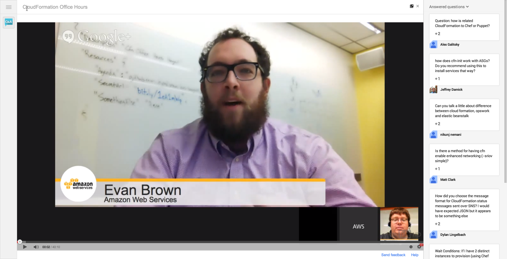

AWS CloudFormation Office Hours: January 30, 2014
========================================================
Thanks for joining AWS Developer Community Manager Evan Brown for CloudFormation Office Hours. The Hangout starts at 9:00 AM PST on Thursday, January 30, and is scheduled for 30 minutes.

This week we're joined by [Adam Thomas](http://www.linkedin.com/pub/adam-thomas/12/215/621/), a Software Development Engineer at AWS, and Chetan Dandekar, Senior Product Manager for CloudFormation. You'll learn from Adam how to securely download content from S3 onto your EC2 Instances when using `cfn-init`, and he'll hang around to help answer questions.

[Check out the index](../README.md) for a list of our previous Hangouts, including detailed agenda and recordings.

## The Recording
Below the recording of the January 30 session, including Q&A:

[](https://plus.google.com/events/cl5s04iq8t39861dvh30fv2h58c)

## Agenda Overview
* New features since the last Hangout
* Community agenda items
* Feature Highlight: Adam Thomas covers using AWS::CloudFormation::Authentication for secure file and sources downloads with `cfn-init`
* Your Q&A

## About the Q&A
Q&A is enabled for this Hangout. To ask your question, click the Ask a new question button in the bottom-right corner of your screen, like so:


You can enter your questions at any point during the hangout. Keep in mind that it takes about 50 seconds before the audio and video to make it through all the tubes to your computer, so by the time you've typed your question we may be on another topic. But don't worry! We've got the final half of the Hangout reserved just for Q&A.

## New Features
On January 27 CloudFormation added 2 new features:

1. **Auto Scaling scheduled actions support**: You can scale the number of Amazon EC2 instances in an Auto Scaling group based on a schedule. By using a schedule, you can scale applications in response to predictable load changes. For more information, see [AWS::AutoScaling::ScheduledAction](http://docs.aws.amazon.com/AWSCloudFormation/latest/UserGuide/aws-resource-as-scheduledaction.html).

2. **Amazon DynamoDB secondary indexes**: You can create local and global secondary indexes for DynamoDB databases. By using secondary indexes, you can efficiently access data with attributes other than the primary key. For more information, see [AWS::DynamoDB::Table](http://docs.aws.amazon.com/AWSCloudFormation/latest/UserGuide/aws-resource-dynamodb-table.html).

3. **Amazon SQS dead letter queues**: You can specify a dead letter queue, where messages are sent when the source queue fails to process on them. For more information, see [AWS::SQS::Queue](http://docs.aws.amazon.com/AWSCloudFormation/latest/UserGuide/aws-properties-sqs-queues.html).

You can always find the latest release notes at [http://aws.amazon.com/releasenotes/AWS-CloudFormation](http://aws.amazon.com/releasenotes/AWS-CloudFormation)

## Community Agenda Suggestions

Kudos to the [alanwill](https://github.com/alanwill), [anthroprose](https://github.com/anthroprose), and [ringods](https://github.com/ringods) who forked the repo, added in some really great suggestions and sent Pull Requests! Let's look at their suggestions:

* Non-disruptive application upgrade: how to go from v1 to v2 of your app without downtime? Is it possible to deploy v2 of your app on new instances and flip the DNS all using CloudFormation?

    > Short answer is yes: if you manage DNS in Route 53 and CloudFormation with [AWS::Route53::RecordSet](http://docs.aws.amazon.com/AWSCloudFormation/latest/UserGuide/aws-properties-route53-recordset.html), you can modify your CloudFormation template to resolve a record to - for example - a new ELB where v2 of your app has been deployed. If you're using [Weighted Record Sets](http://docs.aws.amazon.com/Route53/latest/DeveloperGuide/WeightedResourceRecordSets.html), you can introduce a new version of your application incrementally by adjusting the weight (i.e., distribution) of your Route 53 records in CloudFormation and update the stack periodically.
    >
    > Also consider that AWS Elastic Beanstalk provides an API to facilitate CNAME swap. See [Zero Downtime Deployment](http://docs.aws.amazon.com/elasticbeanstalk/latest/dg/using-features.CNAMESwap.html) for more information.

* How would I make a scalable way of passing Subnet information from one template to another for use with ELBs? ELB Subnets require "Type: A list of strings" however Template Paremeters can be String, Number, or CSV. Some of my regions have 3 AZs, some have 4. Passing subnets with a CSV such as: "ELBSubnets" : { "Fn::Join" : [",", [{ "Ref" : "PublicSubnet0" }, { "Ref" : "PublicSubnet1" }, { "Ref" : "PublicSubnet2" }]]} does not work. For now I need 1 template for 3 subnet ELBs and 1 template for 4 subnet ELBs.

    > CloudFormation supports a few different [input Parameter types](http://docs.aws.amazon.com/AWSCloudFormation/latest/UserGuide/concept-parameters.html), including String and CommaDelimitedList. If you wanted to pass in a set of VPC Subnet IDs, you could use the CommaDelimitedList and Ref it from the ElasticLoadBalance resource:
    
    ```json
    {
      "Parameters": {
        "Subnets": {
          "Type": "CommaDelimitedList"
        }
      },
      "Resources": {
        "ElasticLoadBalancer": {
          "Type": "AWS::ElasticLoadBalancing::LoadBalancer",
          "Properties": {
            "Subnets": {
              "Ref": "Subnets"
            },
            "Listeners": [{
              "LoadBalancerPort": "80",
              "InstancePort": "80",
              "Protocol": "HTTP"
            }]
          }
        }
      }
    }
    ```

* Scalable Subnet Patterns & Best Practices for Multiple Regions & Environments (Production/Staging)

    > This is a good idea to dedicate more time to. We'll cover this in a Feature Focus segment of an upcoming Office Hours soon.

* Security groups that reference themselves. When you have a cluster using the same security group and each node in the cluster needs to communicate with other nodes in the cluster there's a need to create a Security Group rule with ports where the source is the same security group ID. How do you do this with CloudFormation?

    > By default, EC2 Instances in the same SG are not allowed to communicate with eachother. You need to add a self-referencing rule in the Security Group the Instances are running in. Because you can't Ref a Security Group resource in CloudFormation (because the resource doens't exist yet), the [AWS::EC2::SecurityGroupIngress](http://docs.aws.amazon.com/AWSCloudFormation/latest/UserGuide/aws-properties-ec2-security-group-ingress.html) resource type exists to allow you to append ingress rules after resource creation. In this example we declare the `SGBase` resource, and Ref it from the `SGBaseIngress`:
    
    ```json
    {
        "AWSTemplateFormatVersion": "2010-09-09",
        "Resources": {
            "SGBase": {
                "Type": "AWS::EC2::SecurityGroup",
                "Properties": {
                    "GroupDescription": "Base Security Group",
                    "SecurityGroupIngress": [
                        {
                            "IpProtocol": "tcp",
                            "CidrIp": "0.0.0.0/0",
                            "FromPort": "22",
                            "ToPort": "22"
                        }
                    ]
                }
            },
            "SGBaseIngress": {
                "Type": "AWS::EC2::SecurityGroupIngress",
                "Properties": {
                    "GroupName": { "Ref": "SGBase" },
                    "IpProtocol": "tcp",
                    "FromPort": "80",
                    "ToPort": "80",
                    "SourceSecurityGroupName": { "Ref": "SGBase" }
                }
            }
        }
    }
    ```

* Please suggest agenda topics you'd like to see us cover! Fork this repo, add your items to this list, then submit a Pull Request! If we merge your PR, we'll cover the topic in this session!

## Feature Highlight: AWS::CloudFormation::Authentication

CloudFormation produces a helper script named [cfn-init](http://aws.amazon.com/developertools/4026240853893296) that performs one function: getting your application onto a CloudFormation-created EC2 instance.  Cfn-init can do a lot of things (see the [documentation](http://docs.aws.amazon.com/AWSCloudFormation/latest/UserGuide/aws-resource-init.html) for more), but one of the most used features is downloading files and sources.  The difference a file and a source is that a source is extracted once it has been downloaded.

There is a lot of documentation about AWS::CloudFormation::Authentication; two good resources are the [official documentation](http://docs.aws.amazon.com/AWSCloudFormation/latest/UserGuide/aws-resource-authentication.html) and Evan's [blog](http://blogs.aws.amazon.com/application-management/post/Tx3LKFZ27CWZBKO/Authenticated-File-Downloads-with-CloudFormation) on the subject.  Instead of going over every kind of authentication, let's look at the most common kind: IAM Roles with downloads from S3.

I've created a [sample template](s3-role-authentication.json) that we'll use as a demonstration of S3 role downloads.  Since we can't create inline S3 content in templates, this requires a little bit of setup:

1. Create an S3 bucket in your region of choice
2. Upload [an index page](index.html) as `index.html` and some [classy images](images.zip) as `images.zip`
3. Create a stack using the [sample template](s3-role-authentication.json). The only parameter is the name of your S3 Bucket.
4. When the stack hits CREATE_COMPLETE, click on the link in the Outputs tab.

Reminder: this sample uses AWS resources, so it may cost you money if you exceed the [free tier](http://aws.amazon.com/free/)

The mechanics of the template are pretty straightforward.  First, we have to create a role and an instance profile:

```json
"InstanceRole": {
    "Type": "AWS::IAM::Role",
    "Properties": {
        "AssumeRolePolicyDocument": {
            "Statement": [
                {
                    "Effect": "Allow",
                    "Principal": {
                        "Service": [ "ec2.amazonaws.com" ]
                    },
                    "Action": [ "sts:AssumeRole" ]
                }
            ]
        },
        "Path": "/"
    }
},
"RolePolicies": {
    "Type": "AWS::IAM::Policy",
    "Properties": {
        "PolicyName": "S3Download",
        "PolicyDocument": {
            "Statement": [
                {
                    "Action": [ "s3:GetObject" ],
                    "Effect": "Allow",
                    "Resource": [ { "Fn::Join" : ["", ["arn:aws:s3:::", { "Ref" : "S3Bucket" }, "/index.html"]] },
                                  { "Fn::Join" : ["", ["arn:aws:s3:::", { "Ref" : "S3Bucket" }, "/images.zip"]] }]
                }
            ]
        },
        "Roles": [ { "Ref": "InstanceRole" } ]
    }
},
"InstanceProfile": {
    "Type": "AWS::IAM::InstanceProfile",
    "Properties": {
        "Path": "/",
        "Roles": [ { "Ref": "InstanceRole" } ]
    }
}
```

A few things to take away from this snippet:
1. The IAM role is scoped to the [least privilege](http://docs.aws.amazon.com/IAM/latest/UserGuide/IAMBestPractices.html#grant-least-privilege) necessary to download the files.  You only need GetObject for the objects you intend to download -- ListBucket, for instance, is not necessary.
2. An IAM Instance Profile is created, which allows us to associate the IAM Profile to the EC2 instance.  This will allow cfn-init to make authenticated requests to S3.

Next, let's look at the EC2 instance definition.
```json
"WebServer" : {
    "Type" : "AWS::EC2::Instance",
    "Properties" : {
        "IamInstanceProfile" : { "Ref" : "InstanceProfile" },
        "InstanceType" : "t1.micro",
        "SecurityGroups" : [ { "Ref" : "SecurityGroup" } ]
        ...
    }
    ...
}
```

The only real takeaway here is the IamInstanceProfile property, which lets the instance access the role we defined previously.

Finally, we set up the EC2 instance's software configuration in Metadata.  Cfn-init will read this metadata when determining how to set up the instance.

```json
"Metadata" : {
    "AWS::CloudFormation::Authentication" : {
        "S3AccessCreds" : {
            "type" : "S3",
            "roleName" : { "Ref" : "InstanceRole" },
            "buckets" : [{ "Ref" : "S3Bucket" }]
        }
    },
    "AWS::CloudFormation::Init" : {
        "config" : {
            "files" : {
                "/var/www/html/index.html" : {
                    "source" : { "Fn::Join" : ["", ["https://", { "Ref" : "S3Bucket" }, ".s3.amazonaws.com/index.html"]] },
                    "mode" : "000400",
                    "owner" : "apache",
                    "group" : "apache",
                    "authentication" : "S3AccessCreds"
                }
            },
            "sources" : {
                "/var/www/html" : { "Fn::Join" : ["", ["https://", { "Ref" : "S3Bucket" }, ".s3.amazonaws.com/images.zip"]] }
            },
            "services" : {
                "sysvinit" : {
                    "httpd" : {
                        "enabled" : "true",
                        "ensureRunning" : "true"
                    }
                }
            }
        }
    }
}
```

In the `AWS::CloudFormation::Authentication` section, we configure the credentials available to cfn-init. This can include HTTP basic usernames and passwords, AWS Access Keys and Secret Keys, and IAM roles.  Let's take a closer look at the credential:
```json
"S3AccessCreds" : {
    "type" : "S3",
    "roleName" : { "Ref" : "InstanceRole" },
    "buckets" : [{ "Ref" : "S3Bucket" }]
}
```
The `S3` type is, as you would expect, used to authenticate against S3.  `roleName` refers to the role linked to the EC2 instance (not the instance profile).  `buckets` takes a list of bucket names; cfn-init will authenticate any request to the listed buckets with this credential automatically.

Next, let's look at an authenticated file download:
```json
"files" : {
    "/var/www/html/index.html" : {
        "source" : { "Fn::Join" : ["", ["https://", { "Ref" : "S3Bucket" }, ".s3.amazonaws.com/index.html"]] },
        "mode" : "000400",
        "owner" : "apache",
        "group" : "apache",
        "authentication" : "S3AccessCreds"
    }
}
```
The `authentication` key tells cfn-init to explicitly use S3AccessCreds.  In this case, it is superfluous -- since we added `{ "Ref" : "S3Bucket" }` to the list of buckets in the definition of S3AccessCreds, this configuration will do nothing.  In a more practical scenario, you could use the `authentication` key to override the default authentication behavior configured by the `buckets` setting.

Finally, the source:
```json
"sources" : {
    "/var/www/html" : { "Fn::Join" : ["", ["https://", { "Ref" : "S3Bucket" }, ".s3.amazonaws.com/images.zip"]] }
}
```
Here, we don't specify an `authentication` key.  That's because `sources` does not support it.  You *must* use the `buckets` setting in the authentication configuration to make an authenticated `sources` download.

### Troubleshooting Authentication

Authentication can be tricky to get right, and the failure modes are not obvious.

1. Check the logs!

    /var/log/cfn-init.log is your primary source for cfn-init troubleshooting.  You should be able to determine which error code S3 is returning, and which file it's failing on.  If you want more output, you can run cfn-init with -v for verbose output

2. Check your nesting

    The most common mistake people make is nesting `AWS::CloudFormation::Authentication` beneath `AWS::CloudFormation::Init`.  They should be siblings (meaning both should be direct children of `Metadata`), else cfn-init will not be able to find the configuration

3. Check your case

    S3 Object Keys are case sensitive; mismatching case will cause your downloads to fail.

3. Know your S3 error codes

    1. Error code 403: Your user does not have permission, or the key you requested in a *non-public bucket* does not exist

        `[ERROR] Unhandled exception during build: Failed to retrieve https://adamthom-hangouts-demo.s3.amazonaws.com/index.html2: HTTP Error 403 :...`

    2. Error code 404: The key you requested in a *publicly-listable bucket* does not exist

        `[ERROR] Error encountered during build of config: Failed to retrieve https://adamthom-hangouts-demo.s3.amazonaws.com/index.html2:`
        `HTTP Error 404 : <?xml version="1.0" encoding="UTF-8"?><Error><Code>NoSuchKey</Code><Message>The specified key does not exist.</Message>`
        `<Key>index.html2</Key>...`

        or the bucket itself does not exist:

        `[ERROR] HTTP Error 404 : <?xml version="1.0" encoding="UTF-8"?><Error><Code>NoSuchBucket</Code><Message>The specified bucket does not exist</Message>`
        `<BucketName>adamthom-hangouts-demozzzz</BucketName>...`

## Q&A

## Get in Touch
You can find CloudFormation on [Twitter](http://twitter.com/awscloudformer). Evan is on [GitHub](http://github.com/evandbrown), [Twitter](http://twitter.com/evandbrown) or at evbrown (at) amazon.com.

Check out the Application Management Blog at http://blogs.aws.amazon.com/application-management for weekly technical posts about CloudFormation, Elastic Beanstalk, and OpsWorks.

