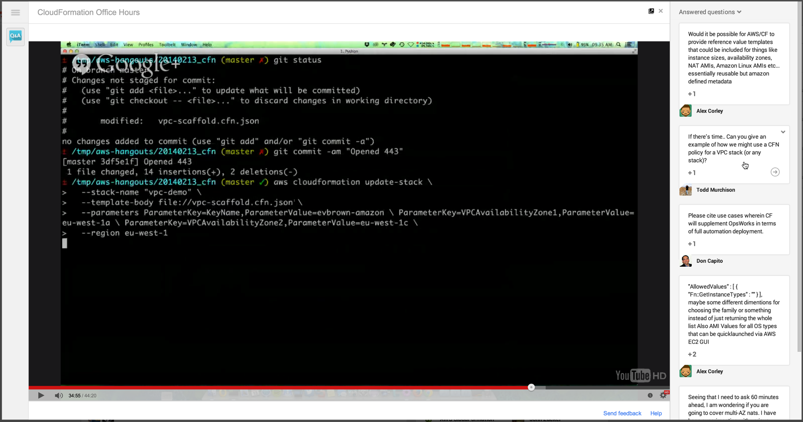
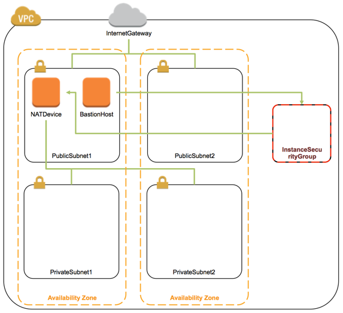

AWS CloudFormation Office Hours: February 13, 2014
========================================================
Thanks for joining AWS Developer Community Manager Evan Brown for CloudFormation Office Hours. The Hangout starts at 9:00 AM PST on Thursday, February 13, and is scheduled for 45 minutes. RSVP for the event at [https://plus.google.com/events/cj7ssql3r1475rf6q9q4vv205no](https://plus.google.com/events/cj7ssql3r1475rf6q9q4vv205no)

[Check out the index](../README.md) for a list of our previous Hangouts, including code samples and recordings.

## The Recording
Below is the recording of the February 13 session, including Q&A:

[](https://plus.google.com/events/cj7ssql3r1475rf6q9q4vv205no)

## Agenda Overview
* New features since the last Hangout
* Community agenda items
* Feature Highlight: VPC
* Your Q&A

## About the Q&A
Q&A is enabled for this Hangout. To ask your question, click the Ask a new question button in the bottom-right corner of your screen.

You can enter your questions at any point during the hangout. Keep in mind that it takes about 50 seconds before the audio and video to make it through all the tubes to your computer, so by the time you've typed your question we may be on another topic. But don't worry! We've got the final half of the Hangout reserved just for Q&A.

## Community Agenda Suggestions
* Add your suggested agenda items here! Check out [Pull Requests](https://github.com/evandbrown/aws-hangouts/pulls?direction=desc&page=1&sort=created&state=closed) from our last Office Hours to see how others have done it.

## New Features

* **Amazon Redshift** - You can now model a Redshift cluster configuration in a CloudFormation template file and have CloudFormation launch the cluster with a few clicks or CLI commands. The template enables you to version control, replicate, or share your Redshift configuration. [Here is a sample CloudFormation template](https://s3.amazonaws.com/cloudformation-templates-us-east-1/Redshift.template) that provisions a Redshift cluster, and here's a snippet:

    ```json
    "Resources": {
        "RedshiftCluster": {
          "Type": "AWS::Redshift::Cluster",
          "Properties": {
            "ClusterType": { "Ref": "ClusterType" },
            "NumberOfNodes": {
              "Fn::If": [
                "IsMultiNodeCluster",
                {
                  "Ref": "NumberOfNodes"
                },
                {
                  "Ref": "AWS::NoValue"
                }
              ]
            },
            "NodeType": { "Ref": "NodeType" },
            "DBName": { "Ref": "DatabaseName" },
            "MasterUsername": { "Ref": "MasterUsername" },
            "MasterUserPassword": { "Ref": "MasterUserPassword" },
            "ClusterParameterGroupName": { "Ref": "RedshiftClusterParameterGroup" }
          },
          "DeletionPolicy": "Snapshot"
        },
        ...
      }
    ```

    Note the use of ``Fn::If` to conditionally set the `NumberOfNodes` property. Check out [the documentation](http://docs.aws.amazon.com/AWSCloudFormation/latest/UserGuide/conditions-section-structure.html) or [our previous Hangout](https://github.com/evandbrown/aws-hangouts/blob/master/20131220_cfn/README.md#conditionals) for more details on Conditional resource creation.

* **AWS Elastic Beanstalk** - Previously, you could use AWS CloudFormation to provision an Elastic Beanstalk application as part of a CloudFormation template and stack. Now, you can use AWS CloudFormation to update that application as well as provisioning it, by updating the associated CloudFormation template and stack.

## Feature Highlight: Declare an Amazon VPC with CloudFormation
We'll walk through building a VPC with public and private subnets, including:

* Provisioning NAT and Bastion instances
* Making Security Group changes by updating the template and stack
* Extending our template to work in multiple regions
* Choosing stack outputs to simplify deploying an app into the VPC

### First Things First
Let's run the sample with the AWS CLI before we start:

```
aws cloudformation create-stack \
  --stack-name "vpc-demo" \
  --template-body file://vpc-scaffold.cfn.json \
  --parameters ParameterKey=KeyName,ParameterValue=evbrown-amazon \ ParameterKey=VPCAvailabilityZone1,ParameterValue=eu-west-1a \ ParameterKey=VPCAvailabilityZone2,ParameterValue=eu-west-1c \
  --region eu-west-1
```

If you run this yourself, be sure to set the KeyName parameter to the name of your EC2 Key Pair.

### Template Scaffold
Our sample VPC template - [vpc-scaffold.cfn.json](vpc-scaffold.cfn.json) - defines the following Parameters, Resources, and Outputs:

**Parameters**

* BastionInstanceType
* KeyName
* NATInstanceType
* NetworkName
* SSHFrom
* VPCAvailabilityZone1
* VPCAvailabilityZone2

**Resources**

* BastionHost
* InstanceSecurityGroup
* NATDevice
* PrivateSubnet1
* PrivateSubnet2
* PublicSubnet1
* PublicSubnet2
* VPC
* ...

> The `vpc-scaffold.cfn.json` template we're working with is over 800 lines. Fortunately the excellent tool `jq` ("like `sed` for JSON data", available at [http://stedolan.github.io/jq/](http://stedolan.github.io/jq/)) makes quick work of digesting CloudFormation templates. I'm sure there's an even better way to do this, but I parsed each block with something like:

>`cat vpc-scaffold.cfn.json | jq '.Resources | to_entries [] | "* "+.key' -r`

### Visualize It
Here's an architecture diagram (with a lot of the lower-level resources left out) of the resulting VPC:



### Key Considerations

Here are a few tey things to note about this VPC:

#### Multi-AZ (2 AZs, to be precise)
This template is designed to run in precisely 2 Availability Zones in whichever Region it's deployed, and you must provide those two AZs in the input params `VPCAvailabilityZone1` and `VPCAvailabilityZone2`.

Why are we explicitly requiring AZs to be input as parameters? After all, CloudFormation does provide the intrinsic function `Fn::GetAZs` that returns all Availability Zones for a Region, and you can even use `Fn::Select` to retrieve the first two zones:

    { "Fn::Select" : [ "0", { "Fn::GetAZs" : "" } ] }
    { "Fn::Select" : [ "1", { "Fn::GetAZs" : "" } ] }

This method works great for EC2 Classic, however `Fn::GetAZs` does not guarantee that a returned AZ is VPC-enabled. It's a good idea to explicitly provide AZs you know support VPC as input Parameters, and that's why we did it in this example:

```json
Parameters: {
...
    "VPCAvailabilityZone1": {
      "Description": "One of two Availability Zones that will be used to create subnets.",
      "Type": "String",
      "MinLength": "1",
      "MaxLength": "255"
    },
    "VPCAvailabilityZone2": {
      "Description": "Two of two Availability Zones that will be used to create subnets. Must be different than VPCAvailabilityZone2.",
      "Type": "String",
      "MinLength": "1",
      "MaxLength": "255"
    }
...
}
```

####  Multi-Region Support

We'd like our template to work in any of the 8 public AWS Regions so we can replicate our infrastructure around the world in a reliable and consistent way. CloudFormation Mappings provide a convenient mechanism to - you guessed it! - map keys to values, and it's very common to use Region names to map to Regionally-specific values.

Here we map out the regionally-specific AMI required to launch the NAT Instance in the `AWSNATAMI` map:

```json
"Mappings": {
...
  "AWSNATAMI": {
    "us-east-1":      { "AMI": "ami-c6699baf" },
    "us-west-2":      { "AMI": "ami-52ff7262" },
    "us-west-1":      { "AMI": "ami-3bcc9e7e" },
    "eu-west-1":      { "AMI": "ami-0b5b6c7f" },
    "ap-southeast-1": { "AMI": "ami-02eb9350" },
    "ap-southeast-2": { "AMI": "ami-ab990e91" },
    "ap-northeast-1": { "AMI": "ami-14d86d15" },
    "sa-east-1":      { "AMI": "ami-0439e619" }
  },
...
}
```

Last week @anthroprose posed [a question via Pull Request](https://github.com/evandbrown/aws-hangouts/pull/3) (did you know you can suggest agenda items via PR? You totally can; you should give it a shot!) around declaring different CIDR ranges for VPCs and Subnets based on region. You might increment the second octet in your VPC CIDR for each region (i.e., 10.1.0.0/16 = us-east-1; 10.2.0.0/16 = us-west-2; etc.) This might serve as a convention so you understand which VPC and Region an Instance is in based on its IP addrses, and would also be important if you're connecting multiple VPCs in different regions to our own datacenter (like a inverse of the [CloudHub pattern](http://docs.aws.amazon.com/AmazonVPC/latest/UserGuide/VPN_CloudHub.html)). To meet this requirement we've declared the `Region2VpcCidr` mapping and entered keys indicating CIDR block for VPCs and both Public and Private Subnets by Region:

```json
"Mappings": {
  ...
  "Region2VpcCidr" : {
    "us-east-1": {
      "VpcCidr": "10.1.0.0/16",
      "PublicSubnet1Cidr": "10.1.100.0/24",
      "PublicSubnet2Cidr": "10.1.101.0/24",
      "PrivateSubnet1Cidr": "10.1.200.0/24",
      "PrivateSubnet2Cidr": "10.1.201.0/24"
    },
    "us-west-1": {
      "VpcCidr": "10.2.0.0/16",
      "PublicSubnet1Cidr": "10.2.100.0/24",
      "PublicSubnet2Cidr": "10.2.101.0/24",
      "PrivateSubnet1Cidr": "10.2.200.0/24",
      "PrivateSubnet2Cidr": "10.2.201.0/24"
    },
    "us-west-2": {
      "VpcCidr": "10.3.0.0/16",
      "PublicSubnet1Cidr": "10.3.100.0/24",
      "PublicSubnet2Cidr": "10.3.101.0/24",
      "PrivateSubnet1Cidr": "10.3.200.0/24",
      "PrivateSubnet2Cidr": "10.3.201.0/24"
    },
    ...
  },
}
```

Later in the template when we declare the VPC and Subnet resources, we simply lookup (`Fn::FindInMap`) the correct CIDR range from the map:

```json
"Resources": {
  "VPC": {
    "Type": "AWS::EC2::VPC",
    "Properties": {
      "CidrBlock": {
        "Fn::FindInMap": ["Region2VpcCidr", { "Ref" : "AWS::Region" }, "VpcCidr"]
      },
      ...
    }
  },
  "PublicSubnet1": {
    "Type": "AWS::EC2::Subnet",
    "Properties": {
      "CidrBlock": {
        "Fn::FindInMap": ["Region2VpcCidr", { "Ref" : "AWS::Region" }, "PublicSubnet1Cidr"]
      },
      "AvailabilityZone": { "Ref": "VPCAvailabilityZone1" },
      ...
    }
  },
  ...
}
```

####  2 Public and 2 Private Subnets
This one's pretty straighforward. We create 2 public subnets (1 in each AZ) and 2 private subnets (also 1 in each AZ).

#### Private Subnets have outbound Internat access (TCP 80 and 443) via NATDevice (EC2 Instance)
We define a route table, then a private route, and associate the private subnets with the table:

```json
"PrivateRouteTable": {
  "Type": "AWS::EC2::RouteTable",
  "Properties": {
    "VpcId": {
      "Ref": "VPC"
    },
    "Tags": [{
      "Key": "Network",
      "Value": { "Fn::Join" : ["-", [{ "Ref": "NetworkName" }, { "Ref": "AWS::Region" }] ]}
    }, {
      "Key": "Network",
      "Value": "Private"
    }]
  }
},
"PrivateRoute": {
  "Type": "AWS::EC2::Route",
  "Properties": {
    "RouteTableId": {
      "Ref": "PrivateRouteTable"
    },
    "DestinationCidrBlock": "0.0.0.0/0",
    "InstanceId": {
      "Ref": "NATDevice"
    }
  }
},
"PrivateSubnet1RouteTableAssociation": {
  "Type": "AWS::EC2::SubnetRouteTableAssociation",
  "Properties": {
    "SubnetId": {
      "Ref": "PrivateSubnet1"
    },
    "RouteTableId": {
      "Ref": "PrivateRouteTable"
    }
  }
},

"PrivateSubnet2RouteTableAssociation": {
  "Type": "AWS::EC2::SubnetRouteTableAssociation",
  "Properties": {
    "SubnetId": {
      "Ref": "PrivateSubnet2"
    },
    "RouteTableId": {
      "Ref": "PrivateRouteTable"
    }
  }
},
```

Notice that the `PrivateRoute` indicates traffice should route through `NATInstance`. That's the EC2 Instance we declared that's configured to run NAT. Notice that we get the AMI from a map (and also that SourceDestCheck is set to false...required for NAT/PAT):

```json
"NATDevice": {
  "Type": "AWS::EC2::Instance",
  "Properties": {
    "InstanceType": {
      "Ref": "NATInstanceType"
    },
    "SubnetId": {
      "Ref": "PublicSubnet1"
    },
    "SourceDestCheck": "false",
    "ImageId": {
      "Fn::FindInMap": ["AWSNATAMI", {
        "Ref": "AWS::Region"
      }, "AMI"]
    },
    "SecurityGroupIds": [{
      "Ref": "NATSecurityGroup"
    }]
  }
},
```

The security group for our NAT Instance is configured to allow TCP 80 and 443 from the CIDR range of our private subnets. We retrieve those ranges from a map:

```json
"NATSecurityGroup": {
  "Type": "AWS::EC2::SecurityGroup",
  "Properties": {
    "SecurityGroupIngress": [{
      "IpProtocol": "tcp",
      "FromPort": "80",
      "ToPort": "80",
      "CidrIp": {
        "Fn::FindInMap": ["Region2VpcCidr", { "Ref" : "AWS::Region" }, "PrivateSubnet1Cidr"]
      }
    }, {
      "IpProtocol": "tcp",
      "FromPort": "443",
      "ToPort": "443",
      "CidrIp": {
        "Fn::FindInMap": ["Region2VpcCidr", { "Ref" : "AWS::Region" }, "PrivateSubnet1Cidr"]
      }
    }],
    ...
  }
},
```

#### Bastion EC2 Instance for SSH access to Instances in Private Subnet
The `BastionHost` resource is an EC2 instance configured to allow SSH access from the public Internet, restricted to the CIDR range you specify in the `SSHFrom` input parameter. Though we've set the default for this param to 0.0.0.0/0, you should always override it with your specific source CIDR range.

#### InstanceSecurityGroup configured to allow TCP 22 from Bastion Instance
Although this stack builds out a VPC, we'll eventually run EC2 Instances and applications inside of it, and we want to be able to SSH to these new Instances from the Bastion. We've gone ahead and declared the `InstanceSecurityGroup` with rules to allow `BastionHost` to connect on TCP 22. We can simply attach this group to future instances, ensuring SSH access from the Bastion:

```json
"InstanceSecurityGroup": {
  "Type": "AWS::EC2::SecurityGroup",
  "Properties": {
    "VpcId": {
      "Ref": "VPC"
    },
    "SecurityGroupIngress": [{
      "IpProtocol": "tcp",
      "FromPort": "22",
      "ToPort": "22",
      "SourceSecurityGroupId": {
        "Ref": "BastionSecurityGroup"
      }
    }],
    "SecurityGroupEgress": [{
      "IpProtocol": "tcp",
      "FromPort": "22",
      "ToPort": "22",
      "SourceSecurityGroupId": {
        "Ref": "BastionSecurityGroup"
      }
    }]
  }
},
```

#### Outputs
Finally, we'll need information from this stack to launch EC2 instances and applications into the VPC in the future. We've included in the Outputs everything we might need to launch an ELB, Elastic Beanstalk app, RDS database, or Auto Scaling group into this VPC at any point in the future, including:

* Bastion
* InstanceSecurityGroup
* PrivateSubnet1
* PrivateSubnet2
* PublicSubnet1
* PublicSubnet2
* VPCAvailabilityZone1
* VPCAvailabilityZone2
* VPCId

### Version Controlled Security!
Let's say we want to modify the `InstanceSecurityGroup` to open TCP 443. Let's add Ingress and Egress rules, commit the template to git, and update the stack with the CLI:

```
aws cloudformation update-stack \
  --stack-name "vpc-demo" \
  --template-body file://vpc-scaffold.cfn.json \
  --parameters ParameterKey=KeyName,ParameterValue=evbrown-amazon \ ParameterKey=VPCAvailabilityZone1,ParameterValue=eu-west-1a \ ParameterKey=VPCAvailabilityZone2,ParameterValue=eu-west-1c \
  --region eu-west-1
```


## Q&A

## Get in Touch
You can find CloudFormation on [Twitter](http://twitter.com/awscloudformer). Evan is on [GitHub](http://github.com/evandbrown), [Twitter](http://twitter.com/evandbrown) or at evbrown (at) amazon.com.

Check out the Application Management Blog at [http://blogs.aws.amazon.com/application-management](http://blogs.aws.amazon.com/application-management) for weekly technical posts about CloudFormation, Elastic Beanstalk, and OpsWorks.

